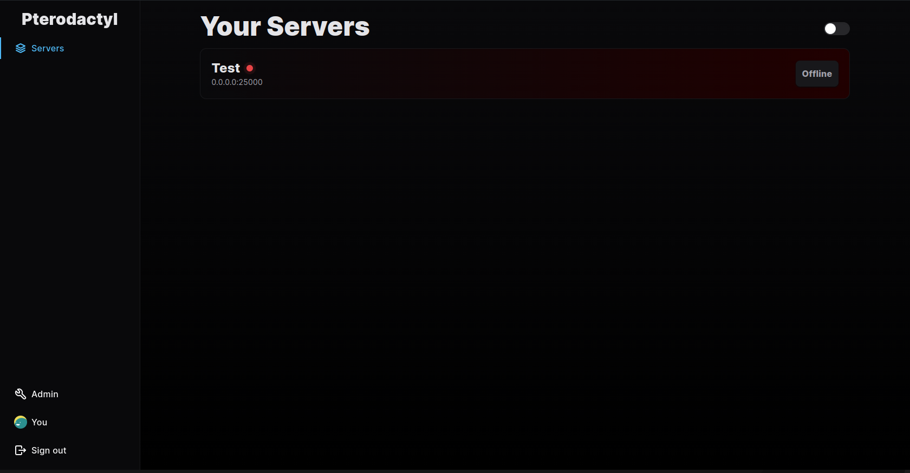
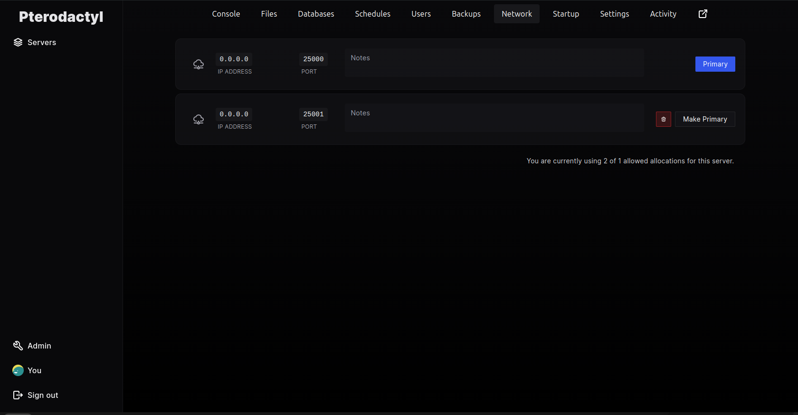
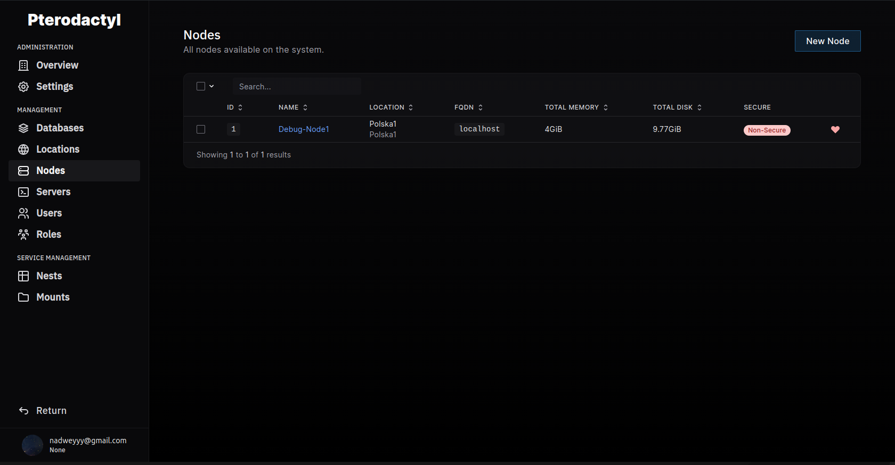

# Pterodactyl

But with modern corporate design.

~~For the love of god, please don't use this fork.~~ I don't think it is that bad, but I still don't recommend using it :D    
It was made because I got angry that the eggs aren't importing on 1.11.5

## Why update every package?

npm

## Some screenshots

## Known issues

- Server's primary allocation id can reference a non-existant/other server's allocation if you do some specific things, but I don't have the brain to fix that, so for now I just recommend editing the database manually
